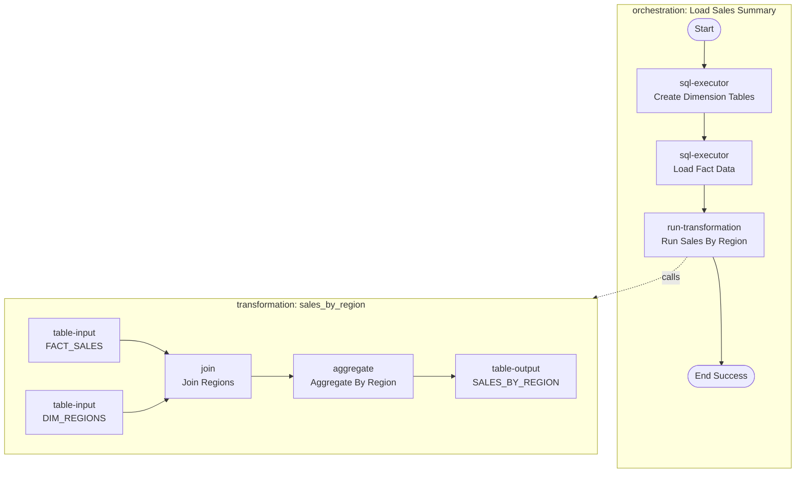
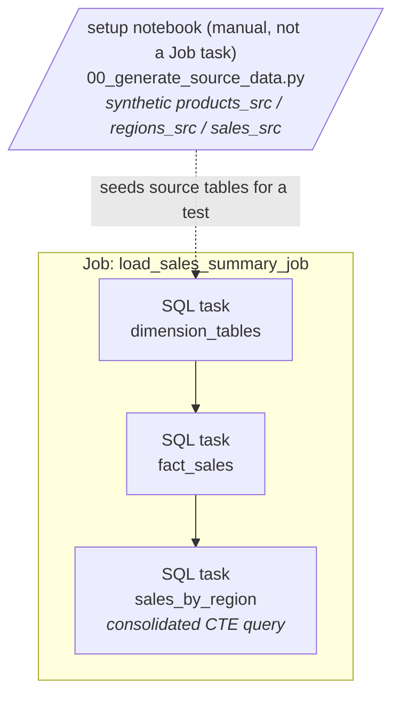

# Demo: Snowflake-backed Matillion (classic JSON export) → Databricks

A complete worked example of the older
Matillion export format — a **single JSON file** bundling every job — from a project
that ran on **Snowflake**. Contrast with `examples/databricks-source/`, which shows the
newer per-pipeline **YAML** (Data Productivity Cloud) format.

Two **independent** things differ from the databricks-source demo, and the skill handles
each separately (they don't imply each other — a JSON export can be Databricks-backed, and
a Snowflake project can be YAML; this demo just happens to vary both at once):
1. **Export format** — classic single-file JSON (numeric `implementationID`, `connectors`
   lists, slot-based `parameters`) instead of per-pipeline `*.orch.yaml` / `*.tran.yaml`.
   Governs *parsing*. See `references/classic-json-format.md`.
2. **Source warehouse backend** — the SQL is **Snowflake** dialect and the goal is to
   migrate *off* Snowflake onto Databricks. Governs *SQL translation*. See
   `references/snowflake-sql.md`.

```
snowflake-source/
├─ matillion/     ← BEFORE: the original Matillion export
│  └─ acme_sales.json     (one file: orchestration "Load Sales Summary" + transformation "sales_by_region")
└─ databricks/    ← AFTER: the converted Databricks Asset Bundle
   ├─ databricks.yml
   ├─ resources/
   │  └─ job.yml            (Job built from the orchestration — no pipeline resource needed)
   └─ src/
      └─ setup/
         ├─ 00_generate_source_data.py  (MANUAL pre-step: synthetic RAW.* source data via dbldatagen — not a Job task)
         ├─ 02_dimension_tables.sql     (sql-executor "Create Dimension Tables" — first Job task)
         ├─ 03_fact_sales.sql           (sql-executor "Load Fact Data")
         └─ 04_sales_by_region.sql      (the transformation, consolidated into one SQL task)
```

> **Source tables are external.** The Snowflake source read from `${v_e_sales_db}.RAW.*`
> tables produced by upstream ingestion — the pipeline never created them, so neither does
> this Job. For a standalone test, run `00_generate_source_data.py` **by hand once** before
> `bundle run`; it fabricates `products_src` / `regions_src` / `sales_src` with synthetic
> data (guarded with `IF NOT EXISTS`, so it no-ops if the real sources already exist). It is
> deliberately **not** a task in the Job — the production pipeline shouldn't fabricate data.

> **Note on the source file:** `acme_sales.json` is a small, **synthetic** example built to
> mirror the structure of real classic-format exports (which bundle many jobs and can be
> hundreds of KB). It is not a real customer project.

## Pipeline shape (before / after)

**Before — Matillion (classic JSON, Snowflake).** One `.json` bundles both jobs. The
orchestration "Load Sales Summary" is a control-flow DAG wired by `connectors`; the
`run-transformation` step calls the "sales_by_region" transformation (its own dataflow
DAG). SQL is Snowflake dialect on `${v_e_sales_db}.SALES.*`:



**After — Databricks Job** (`resources/job.yml`), running on Unity Catalog with the
Snowflake SQL translated to Databricks dialect. Each step is a SQL task; the whole
transformation DAG collapses into the single `sales_by_region` SQL task. The `RAW.*`
source tables are read, not produced (dashed = the manual synthetic-data pre-step that
supplies them for a test, outside the Job):



## How the classic JSON format is read

Unlike the YAML format, this single `.json` encodes job identity and the step graph
structurally — components keyed by numeric `implementationID`, the graph in separate
`connectors` lists, slot-numbered parameters, and all jobs under
`orchestrationJobs` / `transformationJobs` + `jobsTree`. The decoding rules and the
`implementationID` → component-type map are in **`references/classic-json-format.md`**.

## What maps to what

| Matillion (before) | Databricks (after) | Why |
|---|---|---|
| `acme_sales.json` → orchestration "Load Sales Summary" | **Job** `load_sales_summary_job` (`resources/job.yml`) | Control flow → Job |
| `Start` / `End Success` | *(no task — graph boundaries)* | Boundaries carry no work |
| `sql-executor` "Create Dimension Tables" | SQL task → `src/setup/02_dimension_tables.sql` | Seed/DDL setup |
| `sql-executor` "Load Fact Data" | SQL task → `src/setup/03_fact_sales.sql` | Seed/DDL setup |
| `run-transformation` "Run Sales By Region" | **SQL task** → `src/setup/04_sales_by_region.sql` | Pure full-refresh SQL, single output → SQL task (not Lakeflow) |
| transformation "sales_by_region" (`table-input`/`join`/`aggregate`/`table-output`) | one consolidated query (CTE) in that SQL file | Whole chain → one `CREATE OR REPLACE TABLE`, not one dataset per component |

> `00_generate_source_data.py` has **no row above** because it has no counterpart in the
> Matillion source — the source assumes the `RAW.*` tables already exist. It's a manual
> pre-step that fabricates them for a standalone test; ignore it when comparing this demo's
> before/after against the databricks-source demo.

## Snowflake → Databricks conversions

The dialect-translation rules (namespace, `::` casts, `IFF`, `QUALIFY`, `GRANT`, quoted
identifiers, Snowpark/Python UDFs, …) live in **`references/snowflake-sql.md`**. Rather
than repeat them here, each `databricks/src/setup/*.sql` file has a header comment
annotating the specific translations applied to that step — read those alongside the
reference to see the rules in action.

## Try it yourself

Point the skill at `matillion/` and compare its output to `databricks/`:

> "Using the matillion-to-databricks skill, convert the Matillion project in
> `examples/snowflake-source/matillion/`."

## Deploy (optional)

Three ordered steps — step 2 (the manual setup run) is **required** for a standalone test:

```bash
# 1. Deploy the bundle
cd databricks
databricks bundle deploy -t dev --var warehouse_id=<id>

# 2. REQUIRED for a test run: create the synthetic source tables by running the setup
#    notebook once, manually. It is NOT a Job task, so nothing runs it for you; without it
#    step 3 fails at the first read (TABLE_OR_VIEW_NOT_FOUND). Skip only if the real RAW.*
#    source tables already exist in your workspace.
#    → open src/setup/00_generate_source_data.py, set the catalog/schema widgets, Run All
#      (or trigger it via the Jobs UI / `databricks jobs submit`).

# 3. Run the Job
databricks bundle run load_sales_summary_job -t dev
```

> Illustrative output for learning the mapping. Review and adjust (warehouse ID,
> catalog/schema, host) before running against a real workspace.
